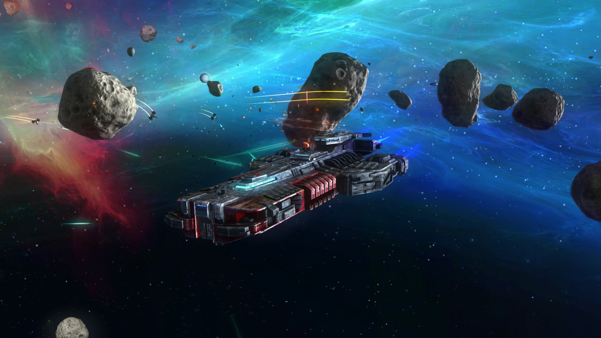

#############
Rebel Galaxy:
#############

******************************************************************************	
The space RPG we all were waiting for.
******************************************************************************
**Author**: William Cole
**Date**: 02/13/2016

Space RPGs until now
--------------------

Until now space roleplaying games consisted of grind mining, small one person
ships and very boring missions. It was very boring to make money, you would 
have to mine asteroids sell the materials and repeat (OVER AND OVER). Also 
having small ships made it very difficult to complete missions when all you're
enemies have a ton of ships. All of those reasons create a horrible user 
experience. Luckily we have Rebel Galaxy to cure these problems.

Double-Damage
-------------

Rebel Galaxy was developed by Double Damage Games. A new company created by the
developers of Diablo and Torchlight. Two games that are RPG's with great depth
and innovative gameplay. One would expect that they would create a great 
experience, and you wouldn't be wrong.

Graphics
--------

The game has amazing graphics, recommended requirements are:

	- CPU:		Intel Core 2 Duo 2.4 GHz
	- RAM:		4 GB
	- Video Card:	Shader Model 3.0, 2GB VRam

Story-line
----------

The Rebel Galaxy story line follows a character who is trying to find his aunt,
who is a character of questionable ethics. As your search continues you come
onto an alien repository. I'm not going to ruin the game for you, but the plot 
gets very interesting allowing you to zig-zag across many star systems 
completing missions in this Space Western.

Side Missions
-------------

General Side Missions
~~~~~~~~~~~~~~~~~~~~~~

The general missions you can find from any station; they consist of:
	- Trade missions 
	- Battle missions
	- Piracy missions

Trade Guild Missions
~~~~~~~~~~~~~~~~~~~~~

Once you join the trade guild, 10000 credits later, you get access to 
incredibly profitable trade missions.

Side Missions Cont.
-------------------

Mercenary Guild Missions
~~~~~~~~~~~~~~~~~~~~~~~~

Once you join the Merc guild you get access to profitable escort and battle 
missions.

Ships
-----

One of the coolest parts of this game are the ships. Generally, as I said in 
the intro slide, space RPG relegates gamers into tiny fighters to fight the
universe. Rebel Galaxy puts you behind the wheel of massive battleships. Even 
your first ship has enough turret points to keep you busy for the first system.
There are 21 ships to choose from, whether you want the speed to run or the
turrets and broadsides to pummel your enemies you've got a ship to fulfil your
needs.

Sound & Music
-------------

When reviewing a game most wouldn't expect the soundtrack as a major part of 
the gameplay.  This game sits in a sub genre of a *space western*, its music
fits perfectly with that genre. A mix of country, blues and hard rock, it 
makes you feel like you are on the Serenity, a ship of **Firefly** fame.

Conclusion
----------

All of the previous reasons culminate into a nearly perfect game. You will need
spend hours doing trade missions to purchase a ship decked out enough that 
would be able to complete the story mission. The story missions, beautiful 
graphics, a rocking soundtrack, complex commodity trading scheme and awesome 
ship design come together to create an awesome game that I recommend for anyone 
to play.
(It can be found on Steam, Xbox One, and the PS4)

